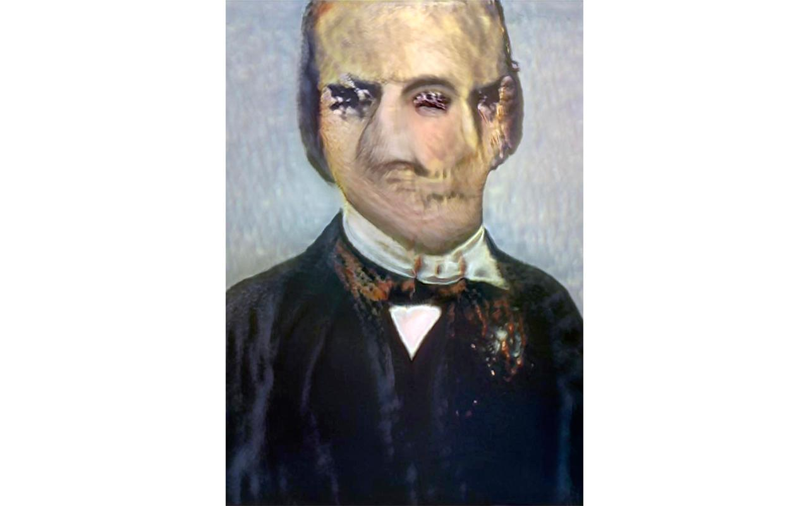
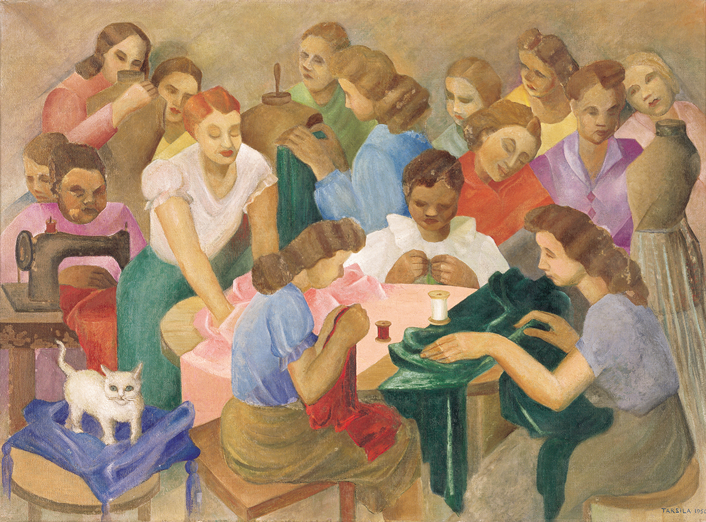
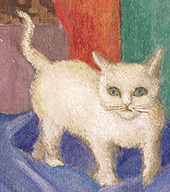
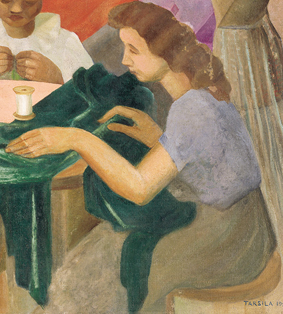
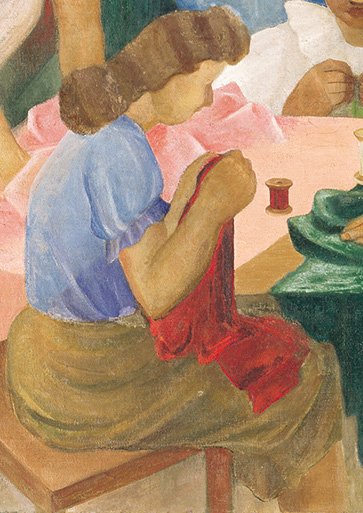
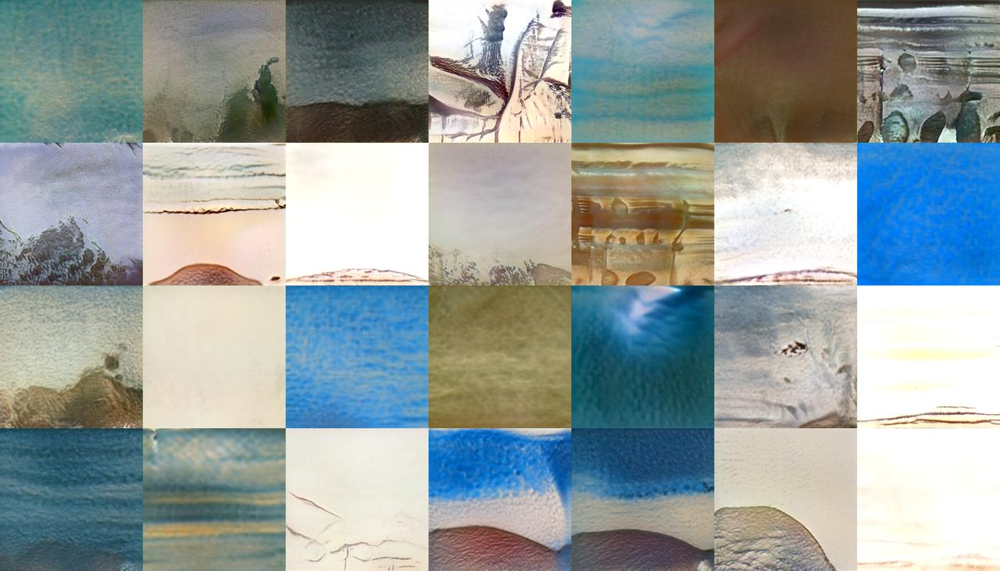

(De)composite Collections
=========================



Bernardo Fontes, source code repository, 2021.

»(De)composite Collections« is an ongoing investigation by Giselle Beiguelman, Bruno Moreschi and Bernardo Fontes into the formation and updates of the colonialist gaze in museum collections. Developed in the context of the intelligent.museum residency, its starting point are artistic collections organized in the first half of the 20th century.

This code has been developed by Bernardo Fontes, as part of the [»The Intelligent Museum«](#the-intelligent-museum).
Funded by the Digital Culture Programme of the Kulturstiftung des Bundes (German Federal Cultural Foundation).
Funded by the Beauftragte der Bundesregierung für Kultur und Medien (Federal Government Commissioner for Culture and Media).
Supported by the Faculty of Architecture and Urbanism of the University of São Paulo (FAU-USP), C4Ai – INOVA-USP and GAIA.

For information on usage and redistribution, and for a DISCLAIMER OF ALL WARRANTIES, see the file, [LICENSE.txt](LICENSE.txt), in this repository.
BSD Simplified License.

Description
-----------

### Summary

This README has the purpose to cover the required technical efforts in order to generate the results analyzed by the project.
A more detailed and conceptual explanation of this can be found on the ZKM website, both in [German](https://zkm.de/de/decomposite-collections) or [English](https://zkm.de/en/decomposite-collections).

The overall technical goal was to train a dozen [GAN models](https://en.wikipedia.org/wiki/Generative_adversarial_network) to synthesize new images based on the catalog of 2 important Brazilian museums as the train dataset.
The museums are the Museu Paulista (MP USP) and the Contemporary Art Museum (MAC – USP).
Each GAN was trained on a dataset consisting of grouped cuts of original artworks from each museum. Each group represents a category we would like to investigate and experiment on top of.
We defined a dozen of categories, but the ones used in (De)composite Collections investigation are:

- Sky
- Flora
- Fauna
- Black Women
- White Women
- Black Men
- White Men
- Indigenous

Unfortunately, due to copyright requirements, we're not allowed to share the whole museums' catalog and neither the resulted datasets with the cuts grouped by these categories.
So, this documentation will try to cover all the steps we needed to go through in order to have the final GAN models trained and to generate results from it.

We strongly recommend you to try to reproduce this process with other open catalogs from museums all across the world.

### Step 1 - Organizing the artworks information

In this step we had to view each image from the museum catalog and give meaning to specific areas. Or, in computer vision terms, to define the [bounding boxes](https://keymakr.com/blog/what-are-bounding-boxes/) of an image.
These areas would then be cut and grouped by their meaning into categories.

This step's final output was a CSV spreadsheet populated by the people who worked on this analysis. The spreadsheet may contain several bounding boxes per image of alternating categories.
The bounding boxes are defined by pixels coordinates, and we used [Image Map Generator website](https://www.image-map.net/) to help us to define them.
Below you will find the header of the preadsheet and one line as an example:

```csv
Tombo,Títulos do objeto,Autor,Data,Técnica,Dimensões,CONTROLE,Céu,Fauna,Flora,Artefatos domesticos,Homem Branco,Homem Indigena,Homem Negro,Mulher Branca,Mulher Indigena,Mulher Negra,TrabalhadorE rural,TrabalhadorE urbano,Paisagem Rural,Paisagem Urbana,Res. abastada,Res. pobre,Igreja
1963.1.243,Costureiras,Tarsila do Amaral,1950 ,óleo sobre tela,"73,3 cm  x 100,2 cm ",,,"76,558,246,750",,"1,359,220,741&-1,662,278,872",,,,"694,340,1173,872&190,137,478,723&362,358,725,871&728,162,934,421&1019,80,1178,453&468,70,739,396&61,32,261,350&711,93,858,270&471,33,653,299&220,88,352,351",,"883,96,1091,437&572,242,858,485&-1,233,253,528",,"883,96,1091,437&572,242,858,485&-1,233,253,528&694,340,1173,872&190,137,478,723&362,358,725,871&728,162,934,421&1019,80,1178,453&468,70,739,396&61,32,261,350&711,93,858,270&471,33,653,299&220,88,352,351",,,,,,
```

The row contains columns with information about the artwork, such as the title, the author, the painting technique used, and also one column per category that we want to crop.
The values in the category columns are the 4 bounding box coordinates that define the crop.
The artwork image in the example is the following one ("Costureiras", by the brazilian artist [Tarsila do Amaral](https://en.wikipedia.org/wiki/Tarsila_do_Amaral)):



So, in the previous example, it limits a `Fauna` bounding box using the following coordinates in pixels:

- 76 (upper left)
- 558 (bottom left)
- 246 (upper right)
- 750 (bottom right)

If there are more than one bounding box per category, the coordinates then get separated by the `&` character, as we have in the column for `Mulher Branca (White woman)`: `694,340,1173,872&190,137,478,723&362,358,725,871&728,162,934,421&1019,80,1178,453&468,70,739,396&61,32,261,350&711,93,858,270&471,33,653,299&220,88,352,351`.
As you can see, there were defined 10 bounding boxes for white woman in this artwork.

We acknowledge the work of our students and researchers in organizing the spreadsheets (one per museum) and helping with the preparation work to build the dataset.

Museum Paulista (MP USP):
Amanda Chevtchouk Jurno, Amanda Vargas, Ana Paula Rodrigues Borges, Gabriel Pereira, Guilherme de Angelo Guimaraes da Silveira, Luisa Vasconcellos Rodrigues, Marco Antonio Christini, Matheus de Sousa Santos, Nathielli Ferreira Ricardo Raquel Serapicos, Carol Monteagudo, Deborah Oliveira Caseiro, Diego Giovani Bonifácio, Gabriel dos Santos Noda, Guilherme Bretas, Guilherme de Angelo Guimarães da Silveira, Guilherme Françoso Santos, Luiza Santos, Mariana Yoshimura, Natalia Bruciaferi Goncalves da Silva, Pedro Oliveira Perri, Roberta Saldanha da Silva Berardo Gomes, Rodrigo Augusto das Neves.

Contemporary Art Museum (MAC – USP):
Gustavo Tiago Aires

### Step 2 - Creating the datasets

Once we have the spreadsheet with all the bounding boxes' information, the next step was to crop the artworks to extract the images we want to use to train the GAN model.
In order to do that, we used a few Python scripts that are placed under the [`src` directory](src).

#### Structure

- `src/constants.py`: constants to configure the scripts. Here you can define things like the project root, the directory with the artwork images, the output directories for the cropped images and other related stuff;
- `src/cli.py`: the command line interface you'll call to read from the CSV spreadsheet, crop the images and generate the output csv;
- `src/csv_parser.py`: helper functions to parse and validate the spreadsheet with the dataset information;

If you want to customize the category columns, you'll have to edit `constants.CAPTIONS` dictionary to match your categorization.

#### Requirements

You'll need to have [Python](https://www.python.org/) and [pip](https://pypi.org/project/pip/) installed on your computer. Once you have both, you'll need to install Python dependencies as follows:

```
$ pip install requests rows pillow tqdm click
```

#### Usage

The `src/cli.py` file has a command called `bbox` that is responsible to crop the images using the bounding box coordinates and organize them under the directory defined by `constants.MOSAIC_DIR`. Here's how to use it:

```
$ python src/cli.py bbox bounding_box.csv
```

Besides organizing the artworks' cuts, it also creates a new CSV file to list the final organization of the images. So, considering the row reference in the step 1, the `output.csv` file will look like:

```
Tombo,Categoria,Área,Títulos do objeto,Autor,Data,Técnica,Dimensões,Categoria Id,Imagem Id,Imagem
1963.1.243,Fauna,"76,558,246,750",Costureiras,Tarsila do Amaral,1950 ,óleo sobre tela,"73,3 cm  x 100,2 cm ",fauna,1963_1_243.jpg,1963.1.243-fauna-00.jpg
1963.1.243,Mulher Branca,"694,340,1173,872",Costureiras,Tarsila do Amaral,1950 ,óleo sobre tela,"73,3 cm  x 100,2 cm ",mulher_branca,1963_1_243.jpg,1963.1.243-mulher_branca-00.jpg
1963.1.243,Mulher Branca,"190,137,478,723",Costureiras,Tarsila do Amaral,1950 ,óleo sobre tela,"73,3 cm  x 100,2 cm ",mulher_branca,1963_1_243.jpg,1963.1.243-mulher_branca-01.jpg
1963.1.243,Mulher Branca,"362,358,725,871",Costureiras,Tarsila do Amaral,1950 ,óleo sobre tela,"73,3 cm  x 100,2 cm ",mulher_branca,1963_1_243.jpg,1963.1.243-mulher_branca-02.jpg
1963.1.243,Mulher Branca,"728,162,934,421",Costureiras,Tarsila do Amaral,1950 ,óleo sobre tela,"73,3 cm  x 100,2 cm ",mulher_branca,1963_1_243.jpg,1963.1.243-mulher_branca-03.jpg
1963.1.243,Mulher Branca,"1019,80,1178,453",Costureiras,Tarsila do Amaral,1950 ,óleo sobre tela,"73,3 cm  x 100,2 cm ",mulher_branca,1963_1_243.jpg,1963.1.243-mulher_branca-04.jpg
1963.1.243,Mulher Branca,"468,70,739,396",Costureiras,Tarsila do Amaral,1950 ,óleo sobre tela,"73,3 cm  x 100,2 cm ",mulher_branca,1963_1_243.jpg,1963.1.243-mulher_branca-05.jpg
1963.1.243,Mulher Branca,"61,32,261,350",Costureiras,Tarsila do Amaral,1950 ,óleo sobre tela,"73,3 cm  x 100,2 cm ",mulher_branca,1963_1_243.jpg,1963.1.243-mulher_branca-06.jpg
1963.1.243,Mulher Branca,"711,93,858,270",Costureiras,Tarsila do Amaral,1950 ,óleo sobre tela,"73,3 cm  x 100,2 cm ",mulher_branca,1963_1_243.jpg,1963.1.243-mulher_branca-07.jpg
1963.1.243,Mulher Branca,"471,33,653,299",Costureiras,Tarsila do Amaral,1950 ,óleo sobre tela,"73,3 cm  x 100,2 cm ",mulher_branca,1963_1_243.jpg,1963.1.243-mulher_branca-08.jpg
1963.1.243,Mulher Branca,"220,88,352,351",Costureiras,Tarsila do Amaral,1950 ,óleo sobre tela,"73,3 cm  x 100,2 cm ",mulher_branca,1963_1_243.jpg,1963.1.243-mulher_branca-09.jpg
1963.1.243,Mulher Negra,"883,96,1091,437",Costureiras,Tarsila do Amaral,1950 ,óleo sobre tela,"73,3 cm  x 100,2 cm ",mulher_negra,1963_1_243.jpg,1963.1.243-mulher_negra-00.jpg
1963.1.243,Mulher Negra,"572,242,858,485",Costureiras,Tarsila do Amaral,1950 ,óleo sobre tela,"73,3 cm  x 100,2 cm ",mulher_negra,1963_1_243.jpg,1963.1.243-mulher_negra-01.jpg
1963.1.243,Mulher Negra,"-1,233,253,528",Costureiras,Tarsila do Amaral,1950 ,óleo sobre tela,"73,3 cm  x 100,2 cm ",mulher_negra,1963_1_243.jpg,1963.1.243-mulher_negra-02.jpg
```

Each row in this file corresponds to a croped image and its respective information. Here are examples of extraction from the previous image for the `Fauna` and `White woman` category:

**Fauna**



**White women**




#### Results

The previous process organizes each dataset by category for each museum.
In our work, the total amount of cropped images per dataset can be found in the following table.

| Images per Category/Museum | MP USP | MAC-USP |
|----------------------------|--------|---------|
| Sky                        | 305    | 95      |
| Flora                      | 602    | 102     |
| Fauna                      | 332    | 130     |
| White women                | 145    | 269     |
| White men                  | 510    | 284     |
| Black women                | 38     | 77      |
| Black men                  | 199    | 89      |
| Indigenous                 | 73     | 13      |

### Step 3 - Training and using the GANs

The next and final step was to train the 16 GAN, one for each dataset from the previous table, and generate the results.

To facilitate and standardize this process, we used [Runway app](https://runwayml.com/) ([this video](https://www.youtube.com/watch?v=vM8Cv8CLmr0) has a demo on how to do that). Each GAN we created is a result of a 8000 steps training of a [StyleGAN2](https://github.com/NVlabs/stylegan2) starting on a pre-trained model of botanical illustrations provided by Runway.

With the trained model, we generated 200 images per category using the same truncation (0.65) and extracted the results we used in the project. Below, you can see an overview of the gallery for the model trained with `Sky` images from MAC-USP:



The Intelligent Museum
----------------------

An artistic-curatorial field of experimentation for deep learning and visitor participation

The [ZKM | Center for Art and Media](https://zkm.de/en) and the [Deutsches Museum Nuremberg](https://www.deutsches-museum.de/en/nuernberg/information/) cooperate with the goal of implementing an AI-supported exhibition. Together with researchers and international artists, new AI-based works of art will be realized during the next four years (2020-2023). They will be embedded in the AI-supported exhibition in both houses. The Project „The Intelligent Museum” is funded by the Digital Culture Programme of the [Kulturstiftung des Bundes](https://www.kulturstiftung-des-bundes.de/en) (German Federal Cultural Foundation) and funded by the [Beauftragte der Bundesregierung für Kultur und Medien](https://www.bundesregierung.de/breg-de/bundesregierung/staatsministerin-fuer-kultur-und-medien) (Federal Government Commissioner for Culture and the Media).

As part of the project, digital curating will be critically examined using various approaches of digital art. Experimenting with new digital aesthetics and forms of expression enables new museum experiences and thus new ways of museum communication and visitor participation. The museum is transformed to a place of experience and critical exchange.


Supporters
----------


