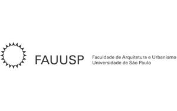

(De)composite Collections
=========================


Bernardo Fontes, source code repository, 2021.

»(De)composite Collections« is an ongoing investigation into the formation and updates of the colonialist gaze in museum collections. Developed in the context of the intelligent.museum residency, its starting point are artistic collections organized in the first half of the 20th century.

This code has been developed by Bernardo Fontes, as part of the [»The Intelligent Museum«](#the-intelligent-museum). 
Funded by the Digital Culture Programme of the Kulturstiftung des Bundes (German Federal Cultural Foundation). 
Funded by the Beauftragte der Bundesregierung für Kultur und Medien (Federal Government Commissioner for Culture and Media).
Supported by the Faculty of Architecture and Urbanism of the University of São Paulo (FAU-USP) C4Ai – INOVA-USP and GAIA.

For information on usage and redistribution, and for a DISCLAIMER OF ALL WARRANTIES, see the file, [LICENSE.txt](LICENSE.txt), in this repository. 
BSD Simplified License.

Description
-----------

### Summary

This README has the purpose to cover the required technical efforts in order to generate the results analyzed by the project.
You can find a more detailed and conceptualized explanation about it in ZKM website, both in [German](https://zkm.de/de/decomposite-collections) or [English](https://zkm.de/en/decomposite-collections) versions.

The overall technical goal was to train a dozen [GAN models](https://en.wikipedia.org/wiki/Generative_adversarial_network) to synthesize new images using the catalog 2 important Brazilian museums as the train dataset.
The museums are the Museu Paulista (MP USP) and the Contemporary Art Museum (MAC – USP).
Each GAN was trained with dataset composed by grouped cuts from the original artworks from each museum. Each group represent a category we would like to investigate and experiment on top of.
We defined a dozen of categories, but the ones used in this work are:

- Sky
- Flora
- Fauna
- Black Women
- White Women
- Black Men
- White Men
- Indigenous

Unfortunately, due to copyright requirements, we're not allowed to share the museums' catalog and neither the resulted datasets with the cuts grouped by these categories.
So, this documentation will try to cover all the steps we needed to go through in order to have the final GAN models trained and to generate results from it.

### Step 1 - Organizing the artworks information

In this step we had to view each image from the museum catalog and give meaning to specific areas. Or, in computer vision terms, to define an image's [bounding boxes](https://keymakr.com/blog/what-are-bounding-boxes/).
These areas would them be used as the images cut and grouped by category. 

This step's final output was spreadsheet populated by the people who were working on it with the many possible bounding box per image. 
The bounding boxes are defined by pixels coordinates, and we used [Image Map Generator website](https://www.image-map.net/) to help us to define them.
Following we have an example of the spreadsheet header and one row formatted as a CSV:

```csv
Tombo,Títulos do objeto,Autor,Data,Técnica,Dimensões,CONTROLE,Céu,Fauna,Flora,Artefatos domesticos,Homem Branco,Homem Indigena,Homem Negro,Mulher Branca,Mulher Indigena,Mulher Negra,TrabalhadorE rural,TrabalhadorE urbano,Paisagem Rural,Paisagem Urbana,Res. abastada,Res. pobre,Igreja
1963.1.243,Costureiras,Tarsila do Amaral,1950 ,óleo sobre tela,"73,3 cm  x 100,2 cm ",,,"76,558,246,750",,"1,359,220,741&-1,662,278,872",,,,"694,340,1173,872&190,137,478,723&362,358,725,871&728,162,934,421&1019,80,1178,453&468,70,739,396&61,32,261,350&711,93,858,270&471,33,653,299&220,88,352,351",,"883,96,1091,437&572,242,858,485&-1,233,253,528",,"883,96,1091,437&572,242,858,485&-1,233,253,528&694,340,1173,872&190,137,478,723&362,358,725,871&728,162,934,421&1019,80,1178,453&468,70,739,396&61,32,261,350&711,93,858,270&471,33,653,299&220,88,352,351",,,,,,
```

The row contains columns with information about the artwork, such as the title, the author, the painting technique used, and also one column per category we want to extract new cuts. 
The values under the categories columns are the 4 bounding box coordinates that should be used to cut the image. 
The artwork image is the following one ("Costureiras", by brazilian artist [Tarsila do Amaral](https://en.wikipedia.org/wiki/Tarsila_do_Amaral)):


So, in the previous example, we can cut a `Fauna` image using the following coordinates in pixels:

- 76 (upper left)
- 558 (bottom left)
- 246 (upper right) 
- 750 (bottom right)

If there are more than one bounding box per category, the coordinates then get separated by the `&` character. As we have in the column for `Mulher Branca (White woman)`: `694,340,1173,872&190,137,478,723&362,358,725,871&728,162,934,421&1019,80,1178,453&468,70,739,396&61,32,261,350&711,93,858,270&471,33,653,299&220,88,352,351`. 
As you can see, there were defined 10 bounding boxes for white woman in this artwork.

We acknowledge the work of our students and researchers in organizing the spreadsheets (one per museum) anh helping with the preparation work to build the dataset.

Museum Paulista (MP USP):
Amanda Chevtchouk Jurno, Amanda Vargas, Ana Paula Rodrigues Borges, Gabriel Pereira, Guilherme de Angelo Guimaraes da Silveira, Luisa Vasconcellos Rodrigues, Marco Antonio Christini, Matheus de Sousa Santos, Nathielli Ferreira Ricardo Raquel Serapicos, Carol Monteagudo, Deborah Oliveira Caseiro, Diego Giovani Bonifácio, Gabriel dos Santos Noda, Guilherme Bretas, Guilherme de Angelo Guimarães da Silveira, Guilherme Françoso Santos, Luiza Santos, Mariana Yoshimura, Natalia Bruciaferi Goncalves da Silva, Pedro Oliveira Perri, Roberta Saldanha da Silva Berardo Gomes, Rodrigo Augusto das Neves.

Contemporary Art Museum (MAC – USP):
Gustavo Tiago Aires

### Step 2 - Creating the dataset

### Step 3 - Training the GANs

### Step 4 - Generating results

The Intelligent Museum
----------------------

An artistic-curatorial field of experimentation for deep learning and visitor participation

The [ZKM | Center for Art and Media](https://zkm.de/en) and the [Deutsches Museum Nuremberg](https://www.deutsches-museum.de/en/nuernberg/information/) cooperate with the goal of implementing an AI-supported exhibition. Together with researchers and international artists, new AI-based works of art will be realized during the next four years (2020-2023). They will be embedded in the AI-supported exhibition in both houses. The Project „The Intelligent Museum” is funded by the Digital Culture Programme of the [Kulturstiftung des Bundes](https://www.kulturstiftung-des-bundes.de/en) (German Federal Cultural Foundation) and funded by the [Beauftragte der Bundesregierung für Kultur und Medien](https://www.bundesregierung.de/breg-de/bundesregierung/staatsministerin-fuer-kultur-und-medien) (Federal Government Commissioner for Culture and the Media).

As part of the project, digital curating will be critically examined using various approaches of digital art. Experimenting with new digital aesthetics and forms of expression enables new museum experiences and thus new ways of museum communication and visitor participation. The museum is transformed to a place of experience and critical exchange.


Supporters
----------




