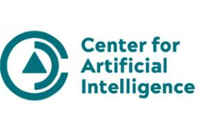

(De)composite Collections
=========================

Bernardo Fontes, source code repository, 2021.

»(De)composite Collections« is an ongoing investigation into the formation and updates of the colonialist gaze in museum collections. Developed in the context of the intelligent.museum residency, its starting point are artistic collections organized in the first half of the 20th century.

This code has been developed by Bernardo Fontes, as part of the [»The Intelligent Museum«](#the-intelligent-museum). 
Funded by the Digital Culture Programme of the Kulturstiftung des Bundes (German Federal Cultural Foundation). 
Funded by the Beauftragte der Bundesregierung für Kultur und Medien (Federal Government Commissioner for Culture and Media).
Supported by the Faculty of Architecture and Urbanism of the University of São Paulo (FAU-USP) C4Ai – INOVA-USP and GAIA.

For information on usage and redistribution, and for a DISCLAIMER OF ALL WARRANTIES, see the file, "LICENSE.txt," in this repository. 
BSD Simplified License.

The Intelligent Museum
----------------------

An artistic-curatorial field of experimentation for deep learning and visitor participation

The [ZKM | Center for Art and Media](https://zkm.de/en) and the [Deutsches Museum Nuremberg](https://www.deutsches-museum.de/en/nuernberg/information/) cooperate with the goal of implementing an AI-supported exhibition. Together with researchers and international artists, new AI-based works of art will be realized during the next four years (2020-2023). They will be embedded in the AI-supported exhibition in both houses. The Project „The Intelligent Museum” is funded by the Digital Culture Programme of the [Kulturstiftung des Bundes](https://www.kulturstiftung-des-bundes.de/en) (German Federal Cultural Foundation) and funded by the [Beauftragte der Bundesregierung für Kultur und Medien](https://www.bundesregierung.de/breg-de/bundesregierung/staatsministerin-fuer-kultur-und-medien) (Federal Government Commissioner for Culture and the Media).

As part of the project, digital curating will be critically examined using various approaches of digital art. Experimenting with new digital aesthetics and forms of expression enables new museum experiences and thus new ways of museum communication and visitor participation. The museum is transformed to a place of experience and critical exchange.

Supporters
----------

